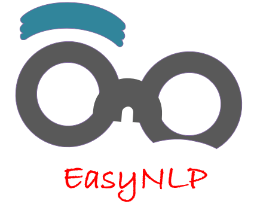

<h1 align="center"></h1>

<p align="center">
  <a href="https://github.com/nrgeup">
    
  </a>
  <a href="https://pypi.org/project/easynlp/">
    
  </a>
  <a href="https://pypi.org/project/easynlp/">
    
  </a>
  <a href="https://github.com/nrgeup/EasyNLP/blob/master/LICENSE">
    
  </a>
  
</p>

> An easy-to-use toolkit for natural language processing tasks.

## Table of Contents

- [Installation](#installation)
- [Examples](#examples)
- [Documentation](https://easynlp.readthedocs.io/en/latest/)
- [FAQ](#faq)
- [License](#license)

## Installation
```bash
pip install easynlp --user
```

## Examples

```python
import easynlp

```

## [Documentation](https://easynlp.readthedocs.io/en/latest/)

## FAQ
- **What is the purpose of building this package?** -
    - For me, just for fun and learning in practice.
    
- **Why is the function of this package so imperfect?** -
    - I am working hard to expand more functions.

## License

[](http://badges.mit-license.org)


