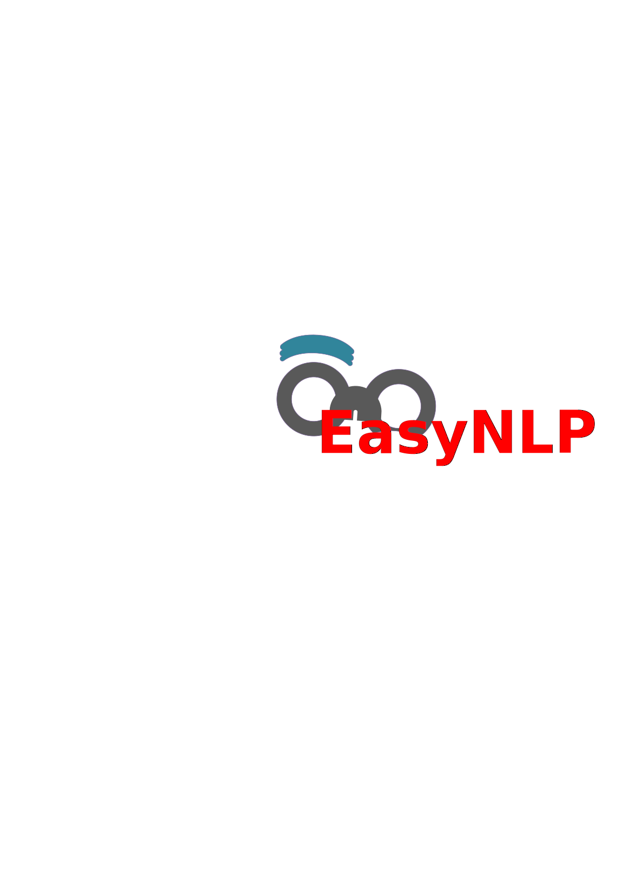

<h1 align="center">EasyNLP</h1>



<p align="center">
  <a href="https://github.com/nrgeup">
    
  </a>
  <a href="https://pypi.org/project/easynlp/">
    
  </a>
  <a href="https://pypi.org/project/easynlp/">
    
  </a>
  <a href="https://github.com/nrgeup/EasyNLP/blob/master/LICENSE">
    
  </a>
</p>

> An easy-to-use toolkit for natural language processing tasks.

## Install

```bash
pip install easynlp --user
```

## Demo


